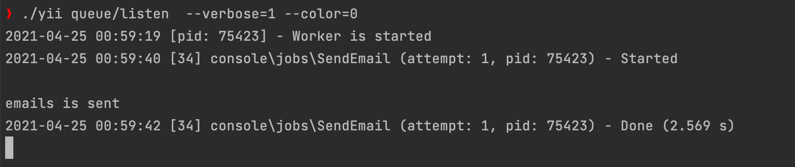

<p align="center">
  
</p>

Documentation is at [docs/guide/README.md](docs/guide/README.md).


Task [Description](docs/task/description.md)

Installation
-------------------

```SendEmail.php
$ composer install

$ ./yii migrate

$ ./yii seeder  

$ ./yii migrate-queue 
```
# 


Supervisord (queue) for test
-------------------
to test the supervisord use
```
$ ./yii queue/listen  --verbose=1 --color=0
```
# 


Admin login pass
-------------------
```
    userName:admin
    password:123456
```

Nginx conf
-------------------
```
server {
    listen 80;
    server_name testTask.owl;

    set $base_root /usr/local/var/www/yii2/testTask;
    root $base_root;

    charset UTF-8;
    index index.php index.html;

    location / {
        root $base_root/frontend/web;
        try_files $uri $uri/ /frontend/web/index.php$is_args$args;

        location ~ ^/assets/.+\.php(/|$) {
            deny all;
        }
    }

    location /admin {
        alias $base_root/backend/web/;

        location = /admin {
            # if your location is "/backend", try use "/backend/backend/web/index.php$is_args$args"
            # bug ticket: https://trac.nginx.org/nginx/ticket/97
            try_files $uri /backend/web/index.php$is_args$args;
        }

        try_files $uri $uri/ /backend/web/index.php$is_args$args;

        location ~ ^/admin/assets/.+\.php(/|$) {
            deny all;
        }
    }

    location ~ ^/.+\.php(/|$) {
        rewrite (?!^/((frontend|backend)/web|admin))^ /frontend/web$uri break;
        rewrite (?!^/backend/web)^/admin(/.+)$ /backend/web$1 break;
        fastcgi_pass 127.0.0.1:9000; # proxy requests to a TCP socket
        fastcgi_split_path_info ^(.+\.php)(.*)$;
        include fastcgi_params;
        fastcgi_param SCRIPT_FILENAME $document_root$fastcgi_script_name;
        try_files $fastcgi_script_name =404;
    }

    location ~ /\. {
        deny all;
    }
}


```
Supervisord for live
-------------------

Install Supervisor with `sudo apt-get install supervisor` in Unix or `brew install supervisor` in Mac OSX. Ensure it's started with `sudo service supervisor restart` in Unix or `brew services start supervisor` in Mac OSX.

In Unix in `/etc/supervisord/conf.d/` create a `.conf` file. In this example, `laravel_queue.conf` (contents below). Give it execute permissions: `chmod +x laravel_queue.conf`.

In Mac OSX first run `supervisord -c /usr/local/etc/supervisord.ini` and in `/usr/local/etc/supervisor.d/` create a `.conf` file. In this example, `laravel_queue.conf` (contents below). Give it execute permissions: `chmod +x laravel_queue.conf`.

This file points at `/usr/local/bin/run_queue.sh`, so create that file there. Give this execute permissions, too: `chmod +x run_queue.sh`.

Now update Supervisor with: `sudo supervisorctl reread` in Unix and with: `brew services restart supervisor` in MAc OSX . And start using those changes with: `sudo supervisorctl update`.

Now run your supervisor queues by `run_queue.sh`.


Supervisor config files usually available in /etc/supervisor/conf.d. You can create any number of config files.
Config example:


Supervisord
```
[program:yii-queue-worker]
process_name=%(program_name)s_%(process_num)02d
command=/usr/bin/php /var/www/my_project/yii queue/listen --verbose=1 --color=0
autostart=true
autorestart=true
user=www-data
numprocs=4
redirect_stderr=true
stdout_logfile=/var/www/my_project/log/yii-queue-worker.log
```

## Packages

| Packages | README |
| ------ | ------ |
| Yii2 Queue extension | https://github.com/yiisoft/yii2-queue/blob/master/docs/guide/README.md |
| yii2-widget-select2 | https://github.com/kartik-v/yii2-widget-select2/blob/master/README.md |
| yii2-seeder | https://github.com/AntonyZ89/yii2-seeder/blob/master/README.md |